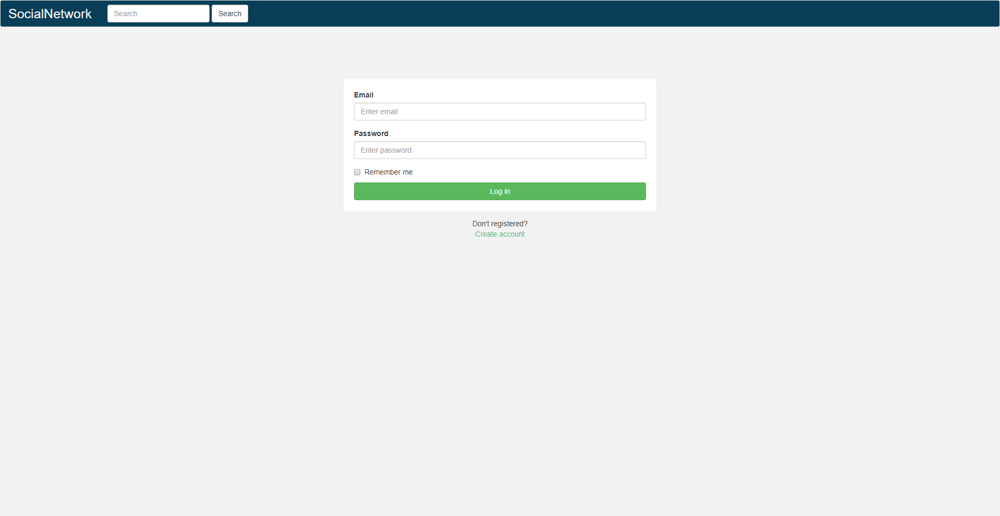
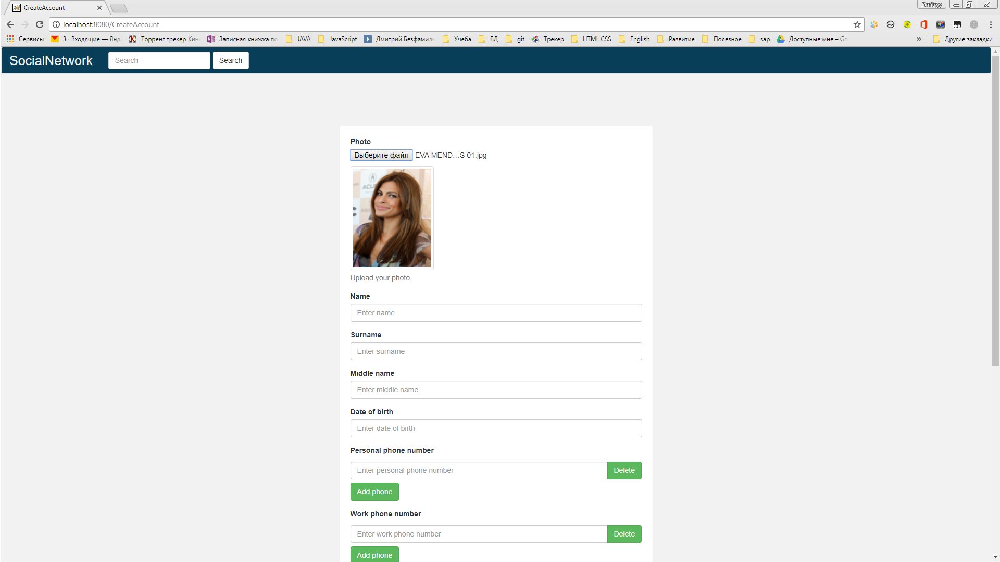
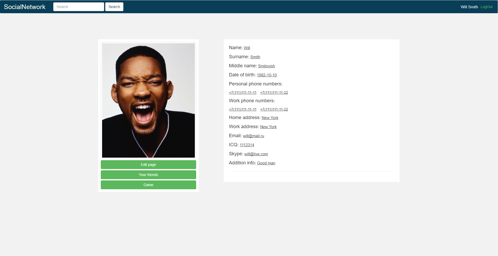
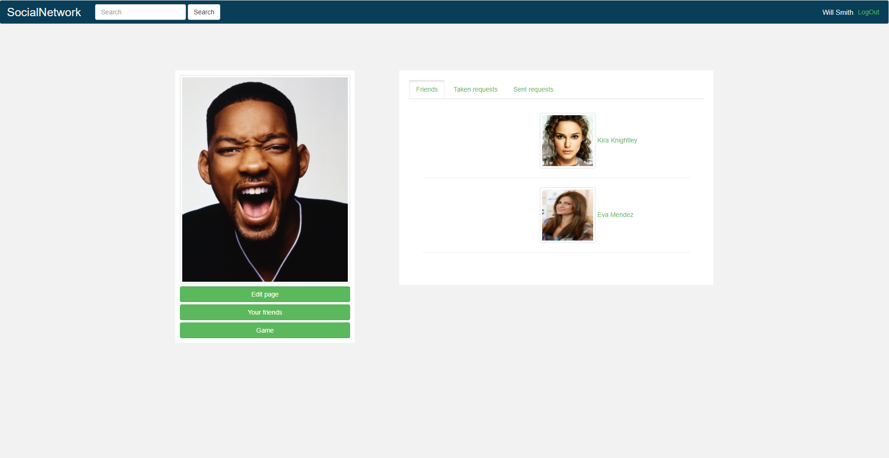
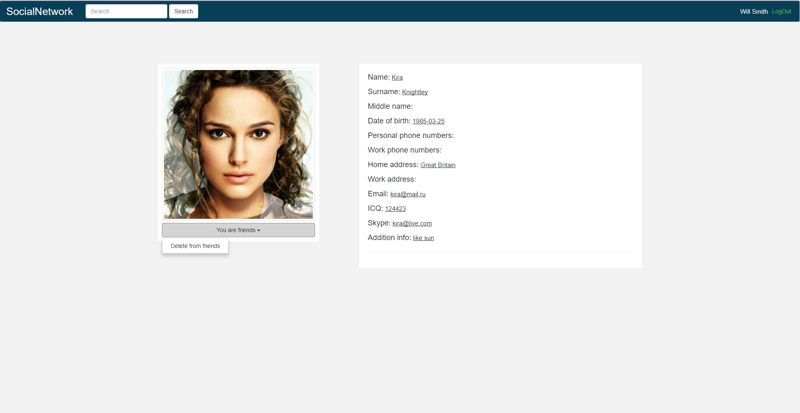
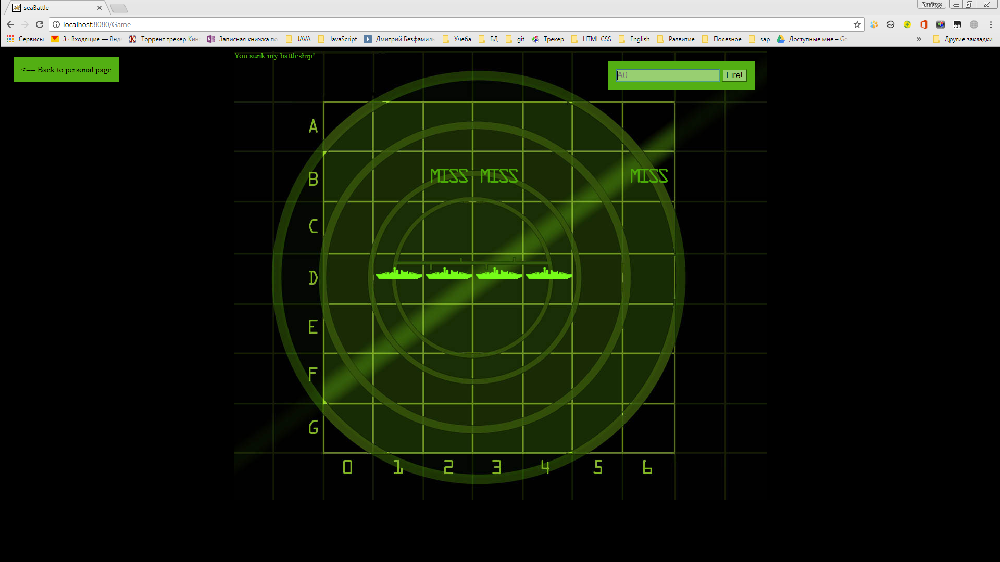
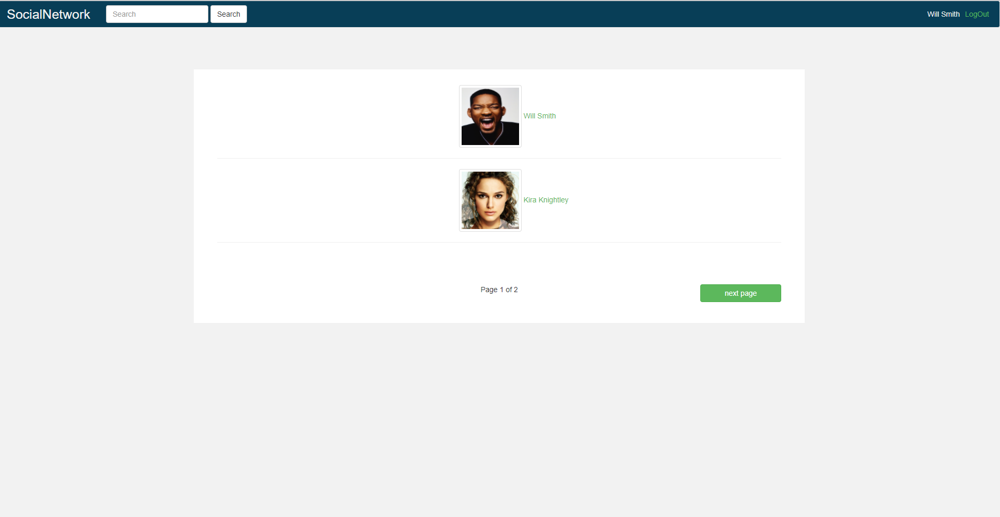
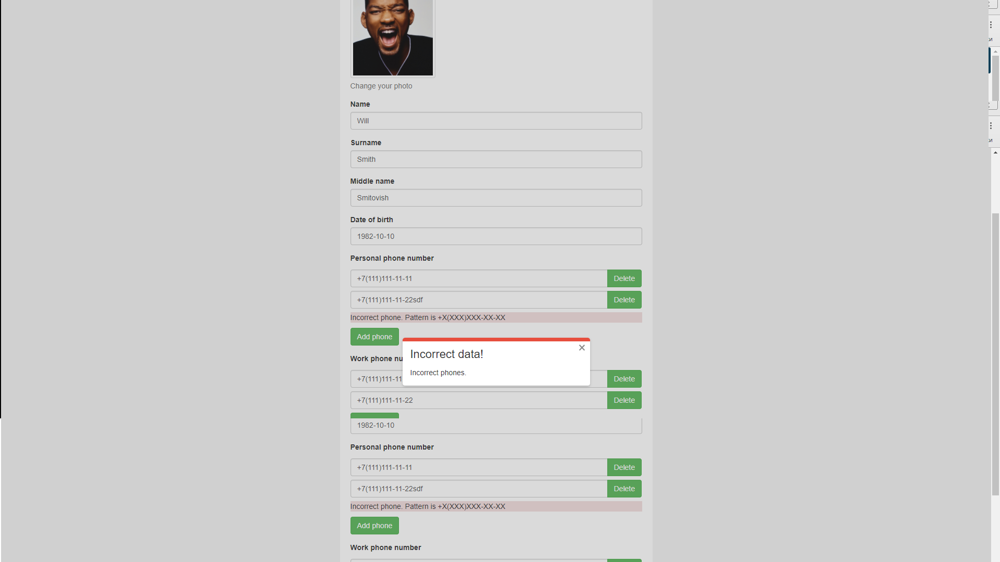
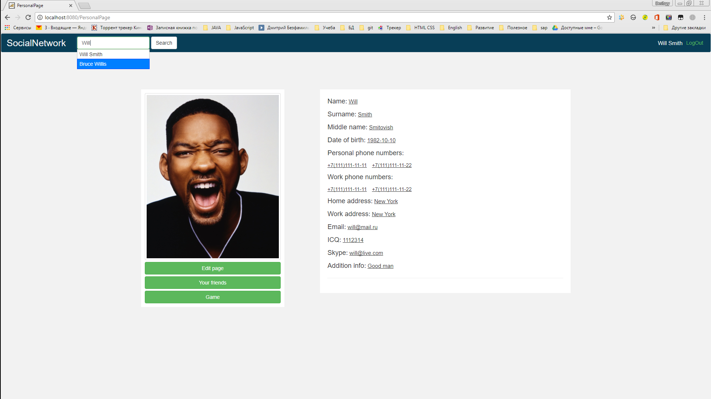
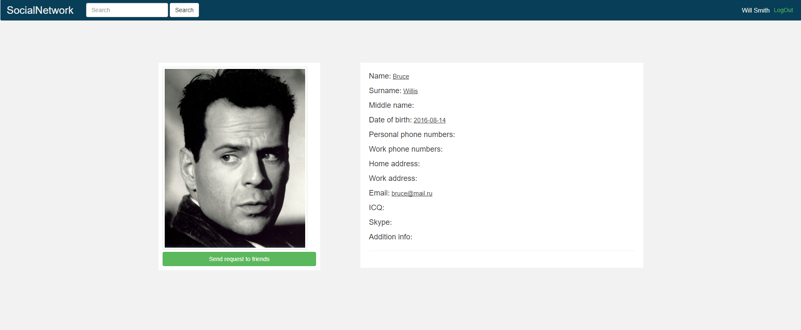

#My Social Network

**Functionality:**
 
 registration   
 authentication  
 ajax search with pagination  
 display profile  
 edit profile  
 edit profile privacy settings  
 upload and download avatar  
 users export/upload to/from xml  
 
**Tools:**  
JDK 7, Spring 4, JPA 2 / Hibernate 4, XStream, jQuery 2, Twitter Bootstrap 3, JUnit 4, Mockito, Maven 3, Git / Bitbucket, Tomcat 7, MySQL, IntelliJIDEA 14.  
 
 
**Notes:**  
SQL ddl is located in the `dao\src\main\resources\create*TBL.sql`
 
**Screenshots**

--  
**Dmitryy Bezfamilnyy**  
Тренинг getJavaJob,   
[http://www.getjavajob.com](http://www.getjavajob.com)